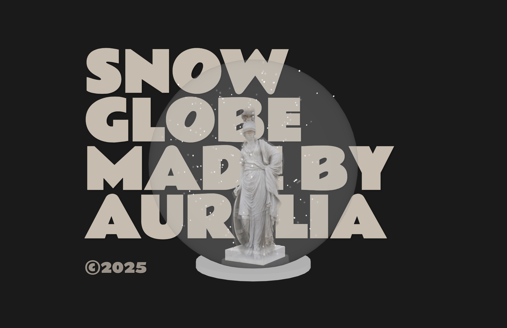

# Snow Globe
A 3D snow globe with a rotating classical sculpture and falling snow, built with Three.js.

## Setup
You'll need a local server to run this project.

[Live Server](https://marketplace.visualstudio.com/items?itemName=ritwickdey.LiveServer) for VS Code is recommended.

## Credits
- 3D Model: "Aspasia" by [noe-3d.at](https://sketchfab.com/www.noe-3d.at)
- Built with [Three.js](https://threejs.org/)

© 2025 Aurelia
